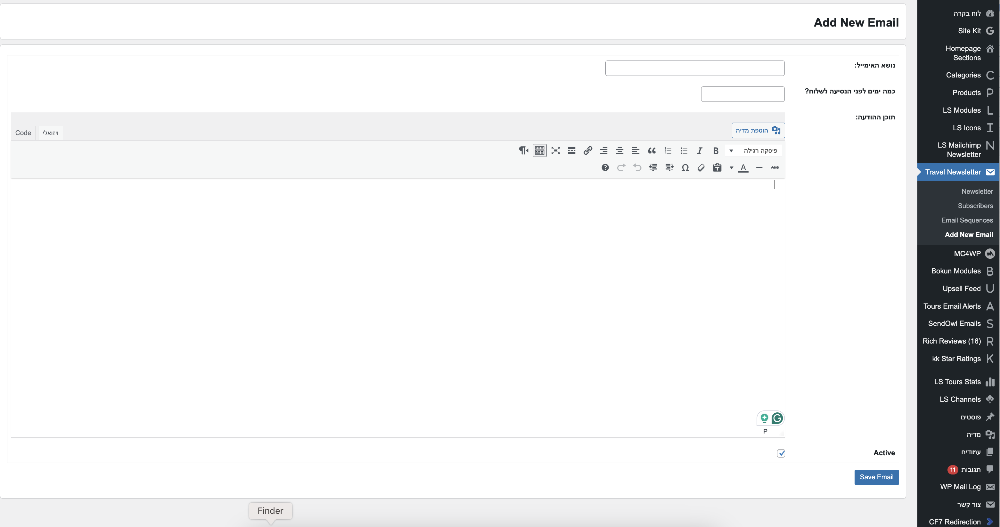

# Travel Newsletter

A WordPress plugin that sends automated, travel date–based newsletter emails to subscribers. Subscribers sign up with their name, email, and travel date; the plugin queues and sends a sequence of emails at set intervals before that date (e.g. 30, 25, 20, 15, 10, 5, and 2 days before).

> **Screen view:**
>
> 

## Features

- **Subscriber signup** – Frontend form (shortcode) to collect name, email, and travel date
- **Email sequences** – One template per “days before travel” (30, 25, 20, 15, 10, 5, 2). You define subject and HTML content per step
- **Automated sending** – WordPress cron runs daily and sends queued emails on the correct date
- **Admin dashboard** – Manage subscribers (view, delete) and email templates (add, edit, preview, send test, delete)
- **Placeholders** – Use `{name}` and `{travel_date}` in subject and body; they are replaced per subscriber
- **Test emails** – Send a test email for any template from the admin
- **Admin notification** – Optional email to the site admin when a new subscriber signs up
- **Translation-ready** – Text domain `travel-newsletter`; strings prepared for translation

## Requirements

- WordPress 5.0 or later
- PHP 7.4 or later

## Installation

1. Download or clone this repository into `wp-content/plugins/travel-newsletter/`.
2. In **WordPress Admin → Plugins**, activate **Travel Newsletter**.
3. On activation, the plugin creates its database tables and schedules the daily cron event.

## Usage

### Add the signup form

Use the shortcode on any page or post:

```
[travel_newsletter_form]
```

Visitors can enter name, email, and travel date. Submissions are validated (including duplicate email check) and emails are queued automatically.

### Manage email sequences

1. Go to **LS Newsletter → Email Sequences** to see all templates.
2. Go to **LS Newsletter → Add New Email** to create or edit a template.
3. For each template set:
   - **Subject** – Can include `{name}` and `{travel_date}`.
   - **Content** – HTML body; same placeholders.
   - **Days before** – One of: 30, 25, 20, 15, 10, 5, 2 (when this email is sent relative to travel date).
   - **Active** – Only active templates are used when queuing/sending.

You can **Preview** and **Send Test Email** from the Email Sequences list.

### Manage subscribers

- **LS Newsletter → Subscribers** – List of all subscribers; you can delete from here.

## How it works

1. **Signup** – Subscriber submits the form; record is saved and emails are queued for the configured “days before” steps that are still in the future.
2. **Queue** – Each (subscriber, template) pair has one queue row with a `send_date`. Past dates are never queued.
3. **Cron** – A daily cron job runs; it sends all queued emails whose `send_date` is today or in the past, then marks them as sent.

## Database tables

The plugin uses three tables (with your WordPress table prefix):

- `{prefix}travel_newsletter_subscribers` – Subscriber name, email, travel date
- `{prefix}travel_newsletter_templates` – Subject, content, days_before, is_active
- `{prefix}travel_newsletter_queue` – subscriber_id, template_id, send_date, status (pending/sent)

## File structure

```
travel-newsletter/
├── travel-newsletter.php          # Main plugin file
├── README.md
├── template-editor.css            # Styles used in email body
├── admin/
│   ├── subscribers-admin-page.php
│   ├── templates-admin-list-pages.php
│   ├── templates-admin-page.php
│   └── templates-main-page.php
├── includes/
│   ├── database-setup-module.php
│   ├── email-handler-module.php
│   ├── email-scheduler-module.php
│   ├── subscriber-module.php
│   └── template-module.php
├── lang/
│   └── newsletter-message.php     # Translatable strings
└── public/
    └── subscriber-signup-form.php # Form markup + script for shortcode
```

## Customization

- **Form text/labels** – Edit `public/subscriber-signup-form.php` and the strings in `lang/newsletter-message.php` (or translate via .po/.mo).
- **Email styling** – Edit `template-editor.css`; its contents are inlined into sent emails.

